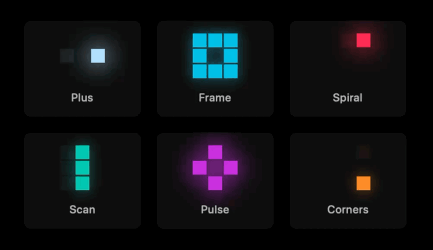

# PixelTiles

A lightweight SwiftUI package for building glowing, animated pixel loaders.

PixelTiles turns simple `3x3` frame patterns into reusable SwiftUI loaders that
fit loading states, creative progress indicators, and compact visual feedback.



## Features

- Animated `3x3` pixel loader view
- Built-in pattern presets
- Custom frame-based patterns
- Configurable color, cell size, spacing, speed, and glow
- Reduce Motion support
- Swift Package Manager integration

## Installation

### Swift Package Manager

Add PixelTiles to your project in Xcode:

1. Open your project.
2. Go to **File > Add Package Dependencies**.
3. Enter the repository URL:

```text
https://github.com/juri-breslauer/PixelTiles.git
```

Or add it to your `Package.swift` dependencies:

```swift
.package(url: "https://github.com/juri-breslauer/PixelTiles.git", from: "0.1.0")
```

Then add `PixelTiles` to your target dependencies:

```swift
.target(
    name: "YourApp",
    dependencies: ["PixelTiles"]
)
```

## Quick Start

```swift
import PixelTiles
import SwiftUI

struct ContentView: View {
    var body: some View {
        PixelTileLoader(
            pattern: .plus,
            tint: .cyan
        )
    }
}
```

## Configuration

```swift
PixelTileLoader(
    pattern: .spiral,
    tint: .pink,
    cellSize: 16,
    spacing: 2,
    interval: 0.12,
    animationDuration: 0.16,
    glow: .bright
)
```

## Built-In Patterns

PixelTiles includes these presets:

```swift
.pulse
.plus
.frame
.corners
.diagonal
.scanLeftToRight
.scanTopToBottom
.spiral
```

## Custom Patterns

Patterns use a `3x3` grid indexed from `1` to `9`:

```text
1 2 3
4 5 6
7 8 9
```

Each inner array is one animation frame:

```swift
let pattern = PixelTilePattern([
    [2],
    [4],
    [6],
    [8]
])

PixelTileLoader(
    pattern: pattern,
    tint: .blue,
    glow: .soft
)
```

To show multiple cells in the same frame, put them in the same inner array:

```swift
let framePattern = PixelTilePattern([
    [1, 2, 3, 6, 9, 8, 7, 4]
])
```

## Demo App

The package includes a small macOS demo app for visually checking loader presets.

Open the package in Xcode:

```bash
open Package.swift
```

Then select:

```text
Scheme: PixelTilesDemo
Destination: My Mac
```

Run with `Cmd + R`.

You can also verify the demo from the command line:

```bash
swift build --product PixelTilesDemo
```

## Development

Build the package:

```bash
swift build
```

Run tests:

```bash
swift test
```

## Requirements

- Swift 6
- iOS 17+
- macOS 14+
- Xcode with SwiftUI support

## License

PixelTiles is available under the MIT License. See [LICENSE](LICENSE) for details.
